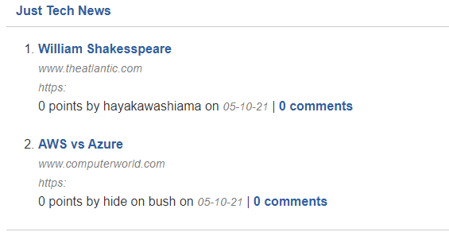
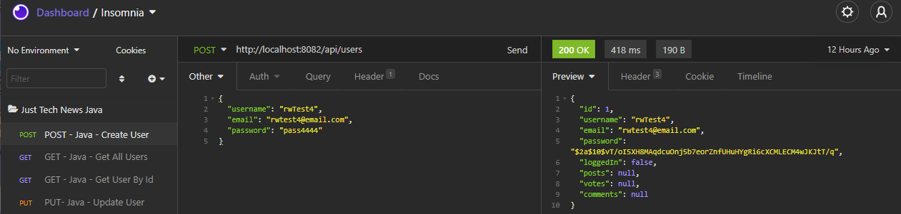

# News5000
## tech-news-java-api
Link sharing Java Full Stack Spring-boot app. Fake news, new news, login and post! Includes personal post dashboard viewing and a homepage with no bounds

## Live application

https://news5000.herokuapp.com/

## Running the tests

* [Insomnia](https://insomnia.rest/) - Server-side testing

## Built With

* [Spring](https://spring.io/) - Framework of the project
* [MVNrepository](https://mvnrepository.com/) - Additional packages
* [Insomnia](https://insomnia.rest/) - Testing

## Contributing

There are many ways in which you can participate in the project, for example:
* Submit bugs and feature requests to the email below, and help us verify as they are checked in
* Review source code changes
* Review the documentation and make pull requests for anything from typos to new content

## Authors

Sole author

## Questions

For any additional questions see my [GitHub profile](http://github.com/tylerpetri) or contact tylerpetri93@gmail.com